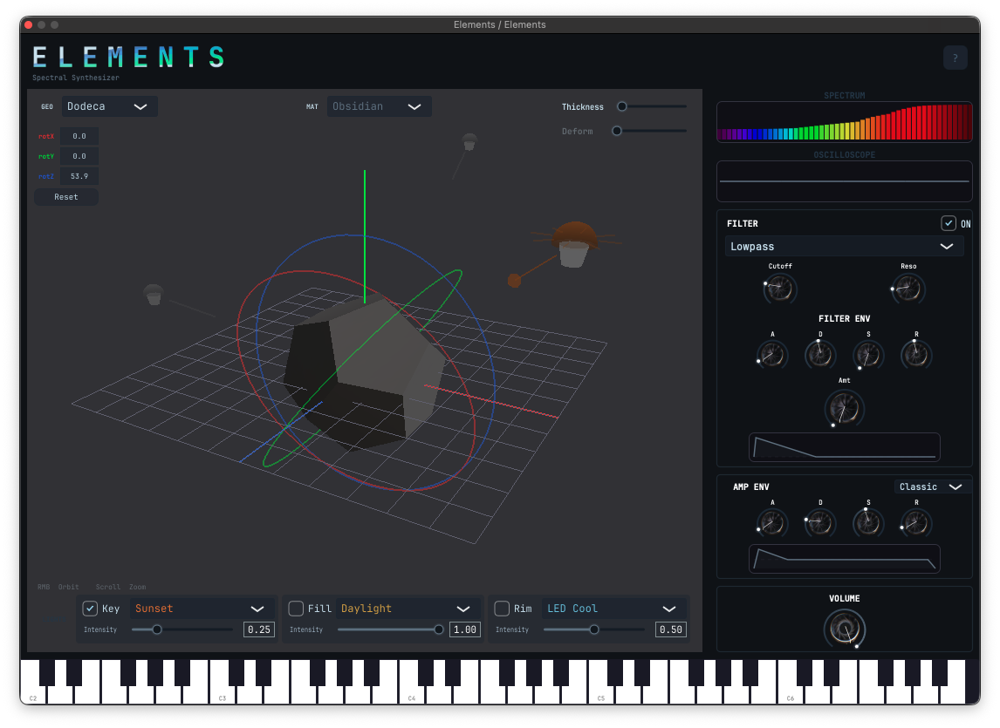
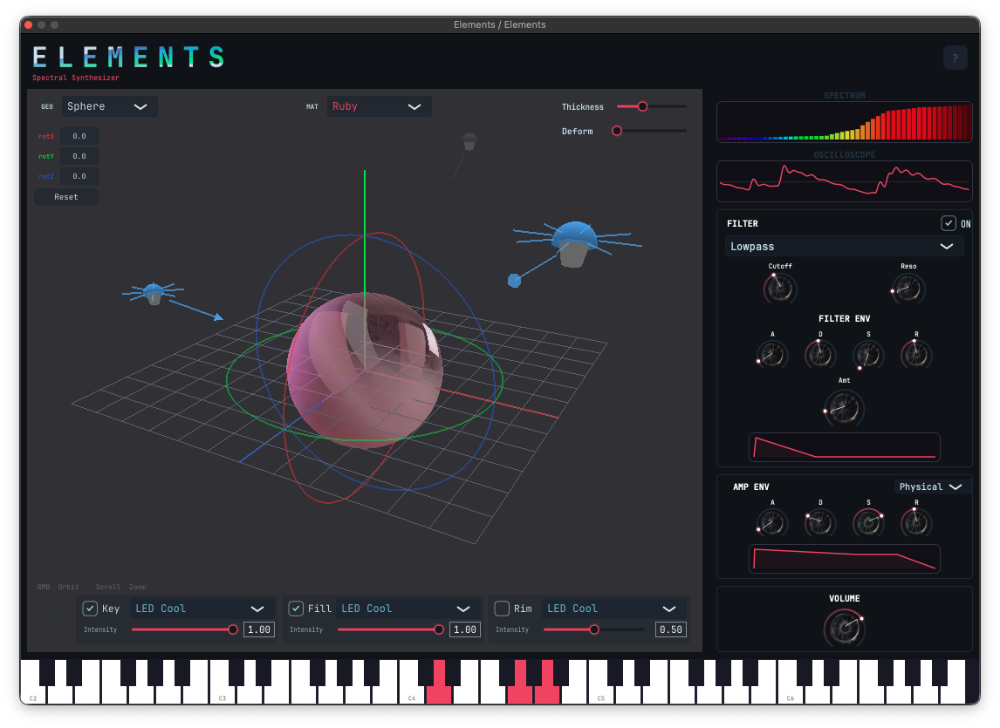
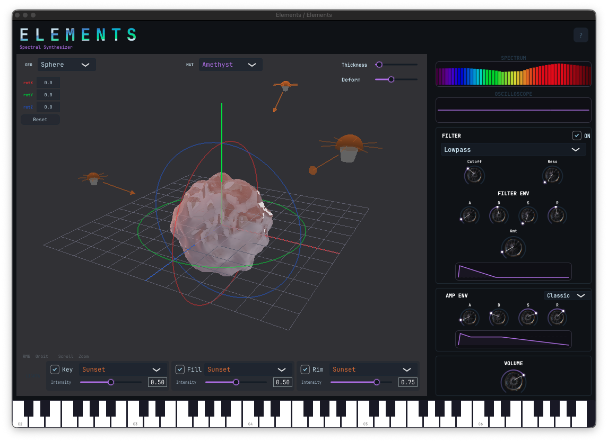

# Quick Start

Your first sound in five steps.

---

## 1. Load Elements in your DAW

Open Elements as a VST3 or AU instrument. If this is your first time, refer to the [Installation guide](installation) for setup instructions including the Gatekeeper bypass required on macOS.

---

## 2. Choose a material and geometry

At the top of the interface, select a **Geometry** (GEO) and a **Material** (MAT) from the dropdown menus.

If you are not sure where to start, use **Sphere + Diamond** — Diamond has the broadest transmission curve and responds well to any light source, and the Sphere produces the smoothest, most immediate sound.

---

## 3. Turn on a light

Elements produces no sound without an active light source. In the Lights Bar at the bottom of the interface:

1. Check the **Key** checkbox to enable the first light slot
2. Select **Daylight** as the light source — it has the broadest emission curve and works with almost every material
3. Set the intensity to **0.5** to start at a neutral pitch

You should now hear sound when you play a note.

> If you hear nothing, verify that the Key light checkbox is checked and that the selected material is compatible with your light source. Some combinations produce near-silence by design — see [Materials & Geometry](materials-and-geometry) for the compatibility guide.

---

## 4. Play with light intensity

While holding a note, move the **Key Intensity** slider. Notice that the pitch responds directly — above 0.5 it rises, below 0.5 it falls. This bidirectional relationship between light and pitch is one of Elements' most expressive performance parameters. Try automating it in your DAW for continuous pitch movement that feels organic rather than mechanical.

---

## 5. Activate the Deformer (Sphere only)

If you have Sphere selected, slowly raise the **Deform** slider. The surface of the sphere begins to deform under a Simplex Noise field — displaced normals introduce timbral variation, a continuous harmonic drift sets in, and the sinusoidal wavefolder starts adding harmonic density. Push it to around 0.4 for a rich, living texture. Pull it back to 0 for a clean, stable tone.

This is Elements at its most expressive.

---

## Starting points

Three ready-to-use combinations to explore different musical roles.

---

### Bass

| | |
|---|---|
| **Geometry** | Dodecahedron |
| **Material** | Obsidian |
| **Key light** | Sunset · 0.25 |
| **Fill light** | Daylight · 1.00 |
| **Rim light** | LED Cool · 0.50 |
| **Envelope** | Classic |
| **Filter** | Lowpass ON |
| **Thickness** | Low |
| **Rotation Z** | ~54° |

Obsidian is the darkest material in Elements — nearly opaque, transmitting only deep red light. Combined with the Dodecahedron's twelve uniformly distributed faces and a low Thickness, it produces a focused, sub-heavy tone with minimal harmonic content. The three-light setup with varied intensities adds subtle spectral complexity without losing the low-end character. Rotate Z to find the sweet spot for your key.

---

### Lead

| | |
|---|---|
| **Geometry** | Sphere |
| **Material** | Ruby |
| **Key light** | LED Cool · 1.00 |
| **Fill light** | LED Cool · 1.00 |
| **Rim light** | Off |
| **Envelope** | Physical |
| **Filter** | Lowpass ON · Env Amt ~0.17 |
| **Thickness** | ~0.80 |
| **Deform** | 0 |

Ruby transmits almost exclusively in the red range — pairing it with cool blue LED lights creates an interesting spectral tension where only the overlap zone between emission and transmission contributes to the sound. Physical Envelope mode derives the ADSR automatically from Ruby's optical properties, producing a fast, punchy attack driven by the high light intensity. The filter envelope adds a subtle brightness contour on each note.

---

### Pad

| | |
|---|---|
| **Geometry** | Sphere |
| **Material** | Amethyst |
| **Key light** | Sunset · 0.50 |
| **Fill light** | Sunset · 0.50 |
| **Rim light** | Sunset · 0.75 |
| **Envelope** | Classic · A 0.018 · D 0.1 |
| **Filter** | Lowpass ON · Filter Env active |
| **Thickness** | Low |
| **Deform** | 0.38 |

Amethyst has a bimodal transmission curve — it passes both violet and red light while absorbing the midrange. Three Sunset lights at different intensities activate both poles of that curve unevenly, producing a complex, shifting harmonic character. With the Deformer at 0.38 the sphere surface is in continuous motion, generating slow timbral drift that evolves naturally over time. The result is a pad that breathes on its own.

**Recommended:** add [Valhalla Supermassive](https://valhalladsp.com/shop/reverb/valhalla-supermassive/) (free) as a send effect for massive spatial depth.

---

## Next steps

- Explore the [Materials & Geometry](materials-and-geometry) page to understand how each combination shapes the sound
- Read the full [Parameters](parameters) reference
- Automate **Rotation X/Y/Z** and **light intensities** from your DAW for continuous timbral movement
- Try combining all three lights with different sources and intensities — the spectral interactions between them are where Elements gets interesting

---

[← Back to Elements](index)
